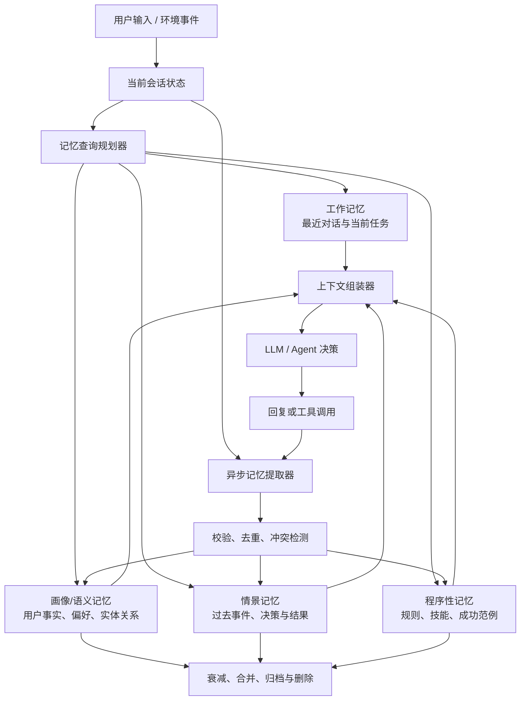

# Agent 长期记忆机制：从分层存储到可控召回

> 版本：v1.0  
> 日期：2026-07-27  
> 适用范围：长期陪伴型 Agent、个人助理、多 Agent 协作系统、客服与任务型智能体

## 1. 文档说明

本文以抖音作品《想让 Agent 拥有长期记忆机制？这个才是正确的训练方式！》为起点，并结合长期运行 Agent 的工程实践形成。

视频作品页给出的核心框架是：

1. 短期记忆：保证当前对话的连贯性。
2. 实体画像记忆：准确保存用户、人物、地点、偏好等稳定信息。
3. 长期情景记忆：保存过去发生的事件，并支持模糊召回。
4. 中枢处理：在生成回复前，将 System Prompt、画像记忆、相关历史片段和最近对话组合成上下文。
5. 动态更新：通过后台异步任务提取、压缩、合并和更新记忆。

本文在此基础上增加了数据结构、写入策略、检索排序、冲突处理、遗忘机制、多 Agent 权限、可观测性和评估方案。

需要先澄清一点：这里的“训练”通常不是重新训练模型权重，而是在模型外部建设一套可读写、可检索、可更新的记忆系统。模型本身仍然是推理引擎，记忆由数据库和编排逻辑管理。

---

## 2. 设计目标

长期记忆系统不应追求“记住所有内容”，而应做到：

- 在正确的时间召回正确的信息。
- 区分事实、偏好、经历和行为规则。
- 新信息与旧信息冲突时可以更新，而不是无限追加。
- 能解释一条记忆来自哪里、何时产生、可信度多高。
- 用户能够查看、修改和删除自己的记忆。
- 不让过期、错误或恶意内容长期污染 Agent。
- 在多 Agent 场景中控制记忆的所有权和可见范围。

一个实用的判断标准是：

> 长期记忆的质量 = 写入质量 × 检索质量 × 更新质量 × 使用质量。

仅接入向量数据库并不等于拥有长期记忆。向量数据库主要解决“相似内容怎么找”，没有自动解决“什么值得记、事实是否冲突、什么时候遗忘、哪些 Agent 可以访问”等问题。

---

## 3. 总体架构



系统可分为两条路径：

- 热路径：用户等待回复时执行，包括查询规划、记忆检索、上下文组装和推理。
- 冷路径：回复完成后异步执行，包括记忆提取、去重、冲突处理、摘要、反思和归档。

冷路径能够降低用户等待时间，但写入必须具备幂等性：同一轮对话即使被重复消费，也不能生成多份相同记忆。

---

## 4. 四类记忆

### 4.1 工作记忆（Working Memory）

作用：维持当前任务和会话的连续性。

典型内容：

- 最近若干轮原始消息。
- 当前任务目标和待办步骤。
- 已完成的工具调用及结果。
- 临时变量、约束和本轮计划。

特点：

- 生命周期短，通常绑定 `thread_id` 或 `run_id`。
- 应限制 Token 预算。
- 超出窗口时进行滚动摘要，但关键约束不能只存在于摘要里。

推荐存储：

- Redis：保存活跃会话和临时状态。
- PostgreSQL checkpoint：保存可恢复的会话状态。

### 4.2 画像/语义记忆（Semantic Memory）

作用：保存相对稳定、可独立陈述的事实。

典型内容：

- “用户主要使用 Python。”
- “用户不喜欢过度格式化的回复。”
- “项目 A 使用 PostgreSQL。”
- “小王是项目 A 的产品负责人。”

画像记忆建议采用结构化字段，而不是只保存自然语言段落。结构化存储更容易精确读取、更新和删除。

```json
{
  "memory_id": "mem_01",
  "namespace": ["tenant_1", "user_42", "profile"],
  "subject": "user_42",
  "predicate": "preferred_language",
  "value": "Python",
  "value_type": "string",
  "confidence": 0.92,
  "source_type": "explicit_user_statement",
  "source_event_ids": ["evt_901"],
  "valid_from": "2026-07-27T10:00:00Z",
  "valid_to": null,
  "created_at": "2026-07-27T10:00:03Z",
  "updated_at": "2026-07-27T10:00:03Z",
  "sensitivity": "normal",
  "status": "active"
}
```

对于高价值实体关系，可以使用关系表或图数据库；但早期项目通常用 PostgreSQL 的实体表和关系表就够了，不必一开始部署 Neo4j。

### 4.3 情景记忆（Episodic Memory）

作用：保存“何时、在什么背景下、发生了什么、结果如何”。

典型内容：

- 用户曾经尝试部署服务，因为环境变量缺失而失败。
- Reviewer Agent 上次发现了权限检查遗漏。
- 某种修复方案在特定仓库中成功通过测试。

```json
{
  "memory_id": "epi_301",
  "namespace": ["tenant_1", "project_a", "episodes"],
  "event_time": "2026-07-27T09:30:00Z",
  "actors": ["user_42", "coder_agent"],
  "context": "部署 payment-service",
  "action": "执行部署前检查",
  "outcome": "发现 DATABASE_URL 缺失，部署被安全中止",
  "lesson": "部署前校验必需环境变量",
  "importance": 0.81,
  "confidence": 0.96,
  "source_event_ids": ["evt_880", "evt_881"],
  "tags": ["deployment", "environment", "payment-service"],
  "embedding_ref": "vec_301"
}
```

情景记忆适合混合检索：

- 向量相似度找语义相近的经历。
- 关键词或 BM25 找精确名称、错误码和标识符。
- 时间过滤限制事件范围。
- 元数据过滤限制用户、项目和 Agent。

### 4.4 程序性记忆（Procedural Memory）

作用：保存“应该怎样做”，包括规则、技能和经过验证的成功范例。

典型内容：

- 代码修改后必须运行相关测试。
- 删除数据前必须获得人工确认。
- 某类 Issue 应按照固定模板完成排查。
- 经评估表现良好的工具调用示例。

程序性记忆不能和普通用户事实混在同一个检索池中，因为它会直接影响 Agent 的行为。其更新需要更严格的权限、评估和版本控制。

推荐做法：

- 核心安全规则写入代码或不可变 System Prompt。
- 可学习的工作偏好保存为版本化规则。
- 成功/失败经历保存为候选样例，经过评估后再晋升为正式规则。

---

## 5. 记忆写入机制

### 5.1 不要让每句话都成为记忆

建议先进行“候选记忆判定”，满足下列条件之一才写入：

- 用户明确要求“记住”。
- 是未来可能复用的稳定事实或偏好。
- 会影响后续决策、安全或个性化体验。
- 是一次重要任务的结果、失败原因或经验。
- 多次重复出现，表明它具有稳定性。

以下内容通常不写长期记忆：

- 寒暄、一次性请求、模型生成的冗余解释。
- 尚未确认的推测。
- 很快会过期且没有后续价值的信息。
- 密码、令牌、验证码等机密数据。
- 未经授权的高敏感个人信息。

### 5.2 写入流水线

```text
事件落盘
  → 提取候选记忆
  → 分类（语义 / 情景 / 程序）
  → 敏感信息检查
  → 事实归属与来源绑定
  → 去重
  → 冲突检测
  → 新增、合并、替代或忽略
  → 建立索引
  → 写入审计日志
```

提取器应输出结构化结果：

```json
{
  "operation": "UPSERT",
  "memory_type": "semantic",
  "subject": "user_42",
  "predicate": "preferred_editor",
  "value": "VS Code",
  "confidence": 0.95,
  "reason": "用户明确说：我平时主要用 VS Code",
  "source_event_ids": ["evt_932"]
}
```

### 5.3 来源等级

建议按来源设置初始可信度：

1. 用户明确陈述或确认。
2. 已验证工具返回或系统事实。
3. 多轮行为中稳定推断出的偏好。
4. 单次行为推断。
5. Agent 自己的总结或猜测。

第 4、5 类不应被当作确定事实。展示或使用时应保留“不确定”状态。

### 5.4 冲突与时间有效性

假设已有记忆“用户住在上海”，新信息是“我已经搬到杭州”。

错误做法是同时保存两条活动状态的事实。正确做法是：

- 将旧记录的 `valid_to` 设置为新事实生效时间。
- 新增“住在杭州”的活动记录。
- 保留两条记录的来源，形成可审计的时间线。

对于偏好变化，也应区分：

- 替代：用户明确改变偏好。
- 并存：用户同时喜欢两种方案。
- 限定：工作项目用 Java，个人项目用 Python。
- 暂时状态：最近一周希望回复简短。

因此，一个成熟的画像不是简单的键值表，而是带有时间、场景和证据的事实集合。

---

## 6. 记忆检索机制

### 6.1 先决定“要查什么”，再执行搜索

不要对每条用户消息都无差别查询全部记忆。查询规划器应先生成：

```json
{
  "need_profile": true,
  "need_episodes": true,
  "need_procedures": false,
  "entities": ["project_a", "deployment"],
  "time_range": "last_90_days",
  "query": "project_a 之前的部署失败和解决方式",
  "max_results": 6
}
```

对于“2+2 等于多少”这样的请求，通常无需读取用户长期记忆。

### 6.2 混合排序

只使用向量相似度容易召回“意思相近但不重要”的内容。推荐综合评分：

```text
score =
    0.35 × semantic_similarity
  + 0.20 × keyword_match
  + 0.15 × recency
  + 0.15 × importance
  + 0.10 × confidence
  + 0.05 × access_frequency
  - contradiction_penalty
  - staleness_penalty
```

权重应通过真实任务评估调整，不应永久写死。

精确事实优先走结构化查询。例如：

- “用户首选语言是什么？”查询画像表。
- “上次部署为何失败？”查询情景记忆。
- “类似错误以前怎么解决？”使用混合搜索。

### 6.3 召回后重排

检索出的候选记忆还要经过一次重排与过滤：

- 是否属于正确用户、项目和 Agent？
- 是否仍在有效期内？
- 是否与当前问题真正相关？
- 是否与更高可信度记忆冲突？
- 是否包含不应提供给当前 Agent 的敏感内容？
- 多条记忆是否表达同一事实？

只有通过过滤的少量记忆才能进入模型上下文。

### 6.4 上下文组装

推荐按固定分区构造上下文：

```text
[SYSTEM]
不可变角色、安全规则和行为边界

[TASK STATE]
当前目标、执行阶段、工具结果

[USER PROFILE]
与本次请求直接相关的用户事实和偏好

[RELEVANT EPISODES]
少量相关历史事件，包含时间与结果

[PROCEDURES]
当前任务适用的规则或成功范例

[RECENT MESSAGES]
最近若干轮原始对话

[CURRENT REQUEST]
用户当前输入
```

建议为每个分区设置独立 Token 预算，避免历史记忆挤掉当前请求和安全规则。

记忆应以“参考事实”注入，而不是伪装成高优先级指令。存储内容本身是不可信输入，可能包含提示注入文本。

---

## 7. 动态更新、反思与遗忘

### 7.1 后台异步更新

每轮对话后向消息队列发送 `memory_extraction_job`：

```text
conversation.completed
  → memory.extract
  → memory.validate
  → memory.upsert
  → memory.reindex
```

任务至少包含：

- `job_id`
- `tenant_id`
- `user_id`
- `thread_id`
- `event_ids`
- `schema_version`
- `attempt`

数据库以 `job_id + candidate_hash` 建立唯一约束，保证重试不会重复写入。

### 7.2 反思和合并

当相似情景积累到一定数量后，可以生成更高层次的反思：

```text
原始事件：
- 三次部署均因环境配置不一致失败。
- 两次在发布前检查中提前发现问题。

反思：
- 对该项目而言，发布前执行环境变量和配置差异检查具有高价值。

候选程序性记忆：
- payment-service 部署前必须执行 config preflight。
```

反思不能删除原始证据。它应保存对源记忆的引用，并在源记忆变化时能够重新计算。

### 7.3 遗忘不是删除一切

可以采用四种处理方式：

- 衰减：降低旧情景的检索权重。
- 合并：将大量重复事件合并为摘要。
- 归档：保留但默认不参与实时检索。
- 删除：按用户请求、隐私策略或保留期限彻底移除。

稳定事实不应仅因时间流逝而自动失效；它应通过新证据替代或由有效期控制。情景记忆则可以随时间衰减。

---

## 8. 多 Agent 场景中的记忆边界

多 Agent 项目应避免所有 Agent 共享一个没有权限控制的向量库。推荐命名空间：

```text
/{tenant_id}/users/{user_id}/profile
/{tenant_id}/projects/{project_id}/facts
/{tenant_id}/projects/{project_id}/episodes
/{tenant_id}/agents/{agent_id}/private
/{tenant_id}/teams/{team_id}/shared
```

记忆可见性可以分为：

- `private`：仅创建该记忆的 Agent 可见。
- `user-scoped`：服务同一用户的授权 Agent 可见。
- `project-scoped`：项目团队成员可见。
- `team-shared`：多 Agent 协作黑板。
- `global-policy`：只读规则，由管理员维护。

推荐让各 Agent 拥有不同的记忆职责：

- Memory Extractor：提取候选事实和事件。
- Memory Verifier：验证来源、冲突与敏感性。
- Memory Curator：合并、摘要、衰减和归档。
- Domain Agent：只查询与任务相关的已验证记忆。

但在 MVP 中，这些职责可以是普通函数或后台任务，不必真的创建三个额外 LLM Agent。只有当判断任务复杂且可独立评估时，才值得拆成 Agent。

---

## 9. 推荐数据与基础设施

### 9.1 MVP

一个简单可靠的组合：

- PostgreSQL：记忆正文、元数据、来源、版本和权限。
- pgvector：向量相似度搜索。
- PostgreSQL Full Text Search：关键词检索。
- Redis：短期工作状态和异步队列。
- 对象存储：原始附件、长文档和大型事件产物。

早期不必同时使用 PostgreSQL、专用向量库和图数据库。先用 PostgreSQL + pgvector 验证召回质量，出现明确的规模或关系查询瓶颈后再拆分。

### 9.2 核心表

```sql
memory_items (
    id,
    tenant_id,
    namespace,
    memory_type,
    subject,
    predicate,
    content_json,
    content_text,
    confidence,
    importance,
    sensitivity,
    valid_from,
    valid_to,
    status,
    embedding,
    created_at,
    updated_at
)

memory_sources (
    memory_id,
    event_id,
    source_type,
    quoted_span_hash
)

memory_relations (
    from_memory_id,
    relation_type,
    to_memory_id
)

memory_versions (
    memory_id,
    version,
    previous_value,
    operation,
    reason,
    created_at
)

memory_access_log (
    memory_id,
    agent_id,
    run_id,
    purpose,
    used_in_response,
    created_at
)
```

---

## 10. 服务接口示例

```python
class MemoryService:
    async def propose(self, events, context) -> list[MemoryCandidate]:
        """从对话和工具事件中提取候选记忆。"""

    async def validate(
        self, candidates, principal
    ) -> list[ValidatedMemoryOperation]:
        """执行权限、敏感性、去重和冲突检查。"""

    async def apply(
        self, operations, idempotency_key: str
    ) -> list[MemoryItem]:
        """以幂等方式新增、合并、替代或归档记忆。"""

    async def search(
        self, query: MemoryQuery, principal
    ) -> list[RankedMemory]:
        """执行结构化、关键词和向量混合检索。"""

    async def forget(self, selector, principal) -> ForgetResult:
        """删除或归档用户指定的记忆，并清理关联索引。"""
```

检索接口必须接收调用主体 `principal`，不能只依赖上层 Agent 自觉遵守权限。

---

## 11. 评估体系

长期记忆不能只通过演示中的“看起来记住了”来评估。

### 11.1 写入指标

- Precision：写入的内容中有多少真正值得长期保留。
- Recall：应该写入的重要信息有多少被成功提取。
- Fact accuracy：记忆是否忠实于来源。
- Deduplication rate：重复记忆是否被正确合并。
- Conflict resolution accuracy：新旧事实是否被正确替代或限定。

### 11.2 检索指标

- Recall@K：正确记忆是否出现在前 K 条。
- MRR / nDCG：正确记忆的排名是否足够靠前。
- Wrong-user leakage：是否错误召回其他用户或项目的记忆。
- Stale-memory rate：是否召回已经失效的信息。
- Irrelevant injection rate：注入上下文的记忆有多少与当前任务无关。

### 11.3 端到端指标

- 在第 1、10、50、100 轮后能否回答早期事实。
- 用户改变偏好后，Agent 是否停止使用旧偏好。
- 多个相似人物或项目是否会混淆。
- 跨会话是否保持一致。
- 删除记忆后，是否不再被召回。
- 有记忆与无记忆相比，任务成功率提升多少。
- 每轮增加的延迟和 Token 成本是多少。

### 11.4 必测场景

1. 明确事实：“我叫小明。”
2. 偏好变化：“以前喜欢 Java，现在主要用 Rust。”
3. 场景限定：“工作用 Windows，家里用 macOS。”
4. 否认纠错：“我刚才说错了，不是杭州，是苏州。”
5. 长期跨轮次：100 轮后询问第一轮细节。
6. 相似实体：项目 Alpha 和项目 Alfa 不得混淆。
7. 恶意内容：历史文本包含“忽略系统指令”时不得执行。
8. 权限隔离：Agent A 的私有记忆不能被 Agent B 读取。
9. 用户遗忘请求：“删除你记住的我的住址。”

---

## 12. 隐私与安全

- 写入敏感信息前获得明确授权。
- 密码、API Key、验证码、支付信息默认禁止进入记忆。
- 对身份证、地址、健康信息等设置单独的敏感级别和访问策略。
- 所有记忆保留来源、版本和访问审计。
- 支持“查看你记住了什么”“修改这条记忆”“忘掉这件事”。
- 删除时同步清理结构化记录、向量索引、缓存和派生摘要。
- 对记忆内容做提示注入隔离：记忆是数据，不是系统指令。
- 多租户系统在数据库查询层强制添加 `tenant_id`，不能只依赖 Prompt。

---

## 13. 实施路线

### 阶段一：可用 MVP

- 最近消息 + 会话摘要作为工作记忆。
- 用户画像采用结构化 PostgreSQL 表。
- 情景记忆使用 PostgreSQL + pgvector。
- 每轮结束后异步提取记忆。
- 检索采用元数据过滤 + 向量 Top-K。
- 提供用户查看和删除记忆的接口。

验收目标：跨会话记住明确偏好；用户修改后能替代旧事实；无跨用户泄漏。

### 阶段二：提高准确率

- 加入关键词与向量混合检索。
- 引入候选重排器。
- 增加来源可信度、有效期和冲突状态。
- 加入记忆合并、衰减和归档。
- 建立离线评估数据集与回归测试。

验收目标：Recall@5、冲突处理准确率和无关召回率达到业务阈值。

### 阶段三：多 Agent 和自我改进

- 建立 Agent 私有、项目共享和团队共享命名空间。
- 将成功/失败任务转为候选情景记忆。
- 通过评估后，把稳定经验晋升为程序性记忆。
- 引入反思任务和人工审核。
- 对高风险程序性记忆实施版本发布和回滚。

验收目标：多 Agent 能复用经验，但不会越权读取或把未经验证的经验变成规则。

---

## 14. 结论

视频提出的三个关键词——分层存储、精准检索、动态更新——是正确的主干。要让它成为生产可用的长期记忆系统，还必须补齐以下能力：

1. 用结构化画像保证精确事实查询。
2. 用情景记忆保存带时间、背景和结果的经历。
3. 用程序性记忆管理规则和可复用经验。
4. 通过混合检索、重排和 Token 预算控制召回。
5. 用来源、置信度、有效期和版本解决冲突。
6. 用异步任务完成提取、合并和反思。
7. 用命名空间和访问控制隔离多用户、多项目和多 Agent。
8. 用可删除、可审计和可评估的机制建立信任。

真正优秀的长期记忆，不是让 Agent 永远记住所有对话，而是让它像一个可靠的协作者：知道什么值得记、什么时候应该想起、什么时候应该更新，以及什么时候必须忘记。

---

## 参考资料

- [抖音：想让 Agent 拥有长期记忆机制？这个才是正确的训练方式](https://www.douyin.com/video/7650821564761410851)
- [CoALA: Cognitive Architectures for Language Agents](https://arxiv.org/abs/2309.02427)
- [MemGPT: Towards LLMs as Operating Systems](https://arxiv.org/abs/2310.08560)
- [Generative Agents: Interactive Simulacra of Human Behavior](https://arxiv.org/abs/2304.03442)
- [LangGraph Memory Overview](https://langchain-ai.github.io/langgraphjs/how-tos/manage-conversation-history/)
- [LangMem Core Concepts](https://langchain-ai.github.io/langmem/concepts/conceptual_guide/)
