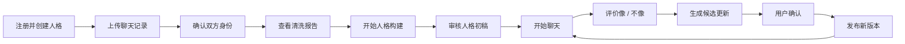

# 对话人格陪伴产品 V1 PRD

> 文档状态：Draft  
> 产品版本：V1.0 MVP  
> 更新时间：2026-07-30  
> 关联文档：[长期记忆机制设计](../agent-long-term-memory-design.md) · [实施方案](./02-implementation-plan.md) · [技术方案](./03-technical-design.md)

## 1. 产品概述

### 1.1 产品定义

用户导入一段经过授权的历史聊天记录，指定需要模拟的目标人物及自己在聊天中的身份。系统分析目标人物的表达习惯、场景化回复方式、关系模式和共同经历，生成一个可查看、可修正、可版本化的“对话人格”。

用户随后可以与该人格持续聊天，并通过“像 / 不像”、原因标签和修改后的理想回复帮助系统逐步补全人格。

产品必须始终说明：

- 这是基于历史数据生成的 AI 模拟人格。
- 它不是现实人物本人，也不能代表本人作出承诺或决定。
- 人格结论可能存在推断错误，用户可以查看、修改和删除。

### 1.2 核心价值

对用户而言：

- 不需要手工编写复杂角色 Prompt。
- 从真实聊天记录中自动生成更贴近目标人物的表达风格。
- 保留双方特有的称呼、话题、相处方式和共同经历。
- 后续通过反馈持续改善，不需要反复重新导入全部数据。

对产品而言：

- 形成“数据导入—人格构建—聊天—反馈—版本更新”的闭环。
- 人格、记忆与模型供应商解耦，可更换模型而保留用户资产。
- 为后续微信小程序、公众号或其他客户端提供统一能力。

## 2. 背景与问题

普通角色聊天产品通常依赖一段预设人设，存在以下问题：

- 人设描述抽象，无法还原具体表达习惯。
- 不理解目标人物与当前用户之间独有的关系。
- 不能解释某项人格结论来自哪些历史记录。
- 随着聊天增加，模型容易发生人格漂移。
- 系统可能错误学习自己生成的内容，越聊越不像。
- 长期记忆、稳定人格和当前情绪经常混为一谈。

V1 需要验证的核心假设是：

> 结构化人格画像 + 真实对话范例检索 + 关系记忆 + 用户反馈，能够比单一长 Prompt 更稳定地生成“像目标人物”的回复。

## 3. 产品目标

### 3.1 V1 目标

1. 用户可以导入一种标准格式和一种常用聊天导出格式。
2. 系统能够正确区分目标人物与当前用户。
3. 系统自动生成人格画像、关系画像、对话范例和共同记忆。
4. 用户能够查看每项人格结论及其证据。
5. 用户能够使用生成的人格进行连续 Web 聊天。
6. 用户能够评价回复，并提交“不像的原因”或修改后的理想回复。
7. 系统能够生成候选人格更新，经过确认后发布新版本。
8. 用户能够查看、修改、删除记忆和人格特征。
9. 系统不会自动把 AI 自己的回复作为人格训练证据。
10. 系统完成基础隐私、安全、权限隔离和可观测性建设。

### 3.2 V1 非目标

V1 不包含：

- 普通个人微信号自动收发消息。
- 多人群聊人格模拟。
- 实时语音通话和声音克隆。
- 视频形象或数字人驱动。
- 自动训练或微调基础模型。
- 完全自主的人格自我修改。
- 多人格自主社交或虚拟世界。
- 付费、订阅、虚拟货币和关系数值游戏化。
- 将人格宣传为现实人物的意识、复活或真实替代。

### 3.3 后续版本

- V1.1：微信小程序客户端、更多导入格式。
- V1.2：图片和语音消息理解、主动话题跟进。
- V2：在具备足够授权数据和评估体系后研究风格微调。

## 4. 目标用户

### 4.1 首批目标用户

- 拥有较长双人聊天历史的个人用户。
- 希望创建具有特定表达方式的私人陪伴角色。
- 愿意参与人格修正和反馈。
- 理解产品是 AI 模拟而非现实人物本人。

### 4.2 暂不服务的场景

- 未获得聊天相关方授权的数据。
- 利用他人身份实施欺骗、诈骗、骚扰或舆论操纵。
- 未成年人恋爱或成人化角色模拟。
- 将系统作为现实人物身份验证、授权或决策依据。
- 未经授权模拟公众人物并对外提供服务。

## 5. 核心概念

### 5.1 目标人物

历史聊天中需要构建对话人格的一方。

### 5.2 当前用户

历史聊天中的另一方，也是后续与人格聊天的用户。

### 5.3 通用人格

跨场景相对稳定的表达和行为倾向，例如回复简短、较少使用句号、倾向给出具体建议。

### 5.4 关系人格

目标人物只在面对当前用户时表现出的称呼、关心方式、玩笑、边界和互动模式。

### 5.5 共同记忆

双方曾经讨论或经历的重要事件。共同记忆属于情景记忆，不等同于人格特征。

### 5.6 对话范例

经过清洗、带有上下文和场景标签的目标人物真实回复片段，用于生成时提供少量参考。

### 5.7 人格版本

一次经过确认和发布的人格快照，包含画像、规则、范例选择策略和关系配置。

## 6. 用户核心流程



## 7. 功能需求

优先级定义：

- P0：V1 上线必需。
- P1：V1 具备则更好，可以延后到 V1.1。
- P2：后续规划。

### 7.1 账号与项目

#### PRD-ACC-001 用户注册与登录（P0）

用户可以通过邮箱或测试环境账号登录。

验收标准：

- 未登录用户不能访问任何人格、聊天和导入数据。
- 用户只能访问自己创建或被授权的人格。
- 登录状态过期后需要重新认证。

#### PRD-ACC-002 创建人格项目（P0）

用户输入：

- 人格显示名称。
- 与目标人物的关系。
- 是否已获得数据使用授权。
- 期望的使用范围：仅自己使用或邀请特定用户。

验收标准：

- 未确认数据权利与产品性质时不能上传聊天记录。
- 新项目初始状态为 `draft`。

### 7.2 聊天记录导入

#### PRD-IMP-001 上传聊天记录（P0）

V1 支持：

- 通用 JSONL。
- 一种经过明确约定的微信文本转换格式。

限制：

- 单文件大小上限由部署配置决定。
- 压缩包必须限制解压大小、文件数量和文件类型。
- 原始文件不得直接暴露公网访问地址。

#### PRD-IMP-002 格式识别与预览（P0）

上传后展示：

- 识别出的参与者。
- 消息总数。
- 时间范围。
- 文本、图片、语音等消息类型数量。
- 无法解析的消息数量。

#### PRD-IMP-003 身份确认（P0）

用户必须明确指定：

- 哪位是目标人物。
- 哪位是当前用户。
- 是否存在第三方参与者。

如果检测到群聊或超过两名主要参与者，V1 阻止继续构建，并提示仅支持双人聊天。

#### PRD-IMP-004 数据清洗报告（P0）

系统展示：

- 重复消息数量。
- 空消息、系统通知和撤回提示数量。
- 无法关联的回复数量。
- 可能包含的手机号、邮箱、地址、账号或密钥。
- 建议排除的第三方敏感片段。

用户确认后才能进入人格构建。

#### PRD-IMP-005 增量导入（P1）

用户可在已有项目中添加新的真实聊天记录。系统按消息指纹去重，只处理新增数据。

### 7.3 人格构建

#### PRD-PER-001 异步人格构建任务（P0）

构建过程包括：

1. 对话分段。
2. 场景分类。
3. 表达统计。
4. 人格候选提取。
5. 关系候选提取。
6. 共同记忆提取。
7. 真实范例筛选。
8. 证据绑定。
9. 低置信度和冲突检测。
10. 评估集留出。

构建期间页面显示进度和当前阶段。

#### PRD-PER-002 人格画像（P0）

展示：

- 回复长度和消息分段习惯。
- 正式程度、直接程度、幽默程度。
- 常用语气和口头表达。
- 不同场景下的回复方式。
- 对工作、冲突、情绪支持等场景的行为倾向。
- 每项结论的置信度。

#### PRD-PER-003 证据查看（P0）

每项人格结论至少关联一条证据，用户可查看脱敏后的上下文。

验收标准：

- 无证据的模型推断不得发布为高置信度人格特征。
- 用户删除源消息后，系统能够标记受影响的人格特征并重新计算。

#### PRD-PER-004 人格修正（P0）

用户可以：

- 修改人格特征描述。
- 调整“更像 / 更不像”的方向。
- 将特征标记为错误。
- 锁定某项人格特征。

锁定后，自动学习不得修改该特征。

#### PRD-PER-005 人格版本（P0）

每次发布记录：

- 版本号。
- 修改摘要。
- 修改依据。
- 操作者。
- 发布时间。
- 可回滚的上一版本。

### 7.4 关系与记忆

#### PRD-MEM-001 关系画像（P0）

展示：

- 双方常用称呼。
- 常聊主题。
- 关心和安慰方式。
- 互动主动性。
- 已识别边界。
- 双方专属表达和玩笑。

#### PRD-MEM-002 共同记忆（P0）

记忆至少包含：

- 时间。
- 参与者。
- 事件摘要。
- 结果或后续。
- 来源消息。
- 置信度。
- 有效状态。

#### PRD-MEM-003 记忆管理（P0）

用户能够：

- 搜索记忆。
- 修改错误记忆。
- 删除单条记忆。
- 暂停新记忆写入。
- 清空人格项目全部数据。

删除必须覆盖正文、检索索引、缓存和派生摘要。

### 7.5 陪伴聊天

#### PRD-CHAT-001 新建和继续会话（P0）

用户能够与已发布人格聊天，并查看历史会话。

#### PRD-CHAT-002 流式回复（P0）

Web 端展示逐步生成效果；断线后允许重新连接或获取最终结果。

#### PRD-CHAT-003 人格回复生成（P0）

生成时使用：

- 当前人格版本。
- 关系画像。
- 当前会话最近消息。
- 相关共同记忆。
- 与当前场景相似的真实对话范例。
- 不可变安全和身份边界。

#### PRD-CHAT-004 来源解释（P1）

调试模式下，用户可以查看：

- 使用了哪些人格特征。
- 召回了哪些记忆。
- 使用了哪些范例。

默认不向普通聊天界面展示内部 Prompt。

#### PRD-CHAT-005 身份说明（P0）

聊天页面持续提供可见入口，说明当前对象为 AI 模拟人格。

当用户询问“你是不是本人”时，系统必须明确否认。

### 7.6 反馈与持续补全

#### PRD-FBK-001 像 / 不像反馈（P0）

每条 AI 回复提供：

- 像。
- 不像。
- 跳过。

#### PRD-FBK-002 原因标签（P0）

选择“不像”后可选择：

- 太长或太短。
- 太热情或太冷淡。
- 用词不像。
- 不会主动提建议。
- 不会知道这件事。
- 与双方关系不符。
- 情绪反应不符。
- 其他。

#### PRD-FBK-003 理想回复（P0）

用户可输入“目标人物更可能怎样回复”。该内容保存为用户提供的候选范例，并与真实历史范例明确区分。

#### PRD-FBK-004 候选人格更新（P0）

系统按批次聚合反馈，生成候选更新。

更新默认状态为 `pending_review`，不能直接影响线上人格。

#### PRD-FBK-005 禁止自我污染（P0）

AI 生成回复不能作为事实、人格特征或真实范例写回系统，除非用户显式确认。

### 7.7 安全与隐私

#### PRD-SAFE-001 数据权利确认（P0）

上传前需要用户确认其有权处理相关聊天数据。

#### PRD-SAFE-002 敏感信息检测（P0）

默认阻止长期保存：

- 密码。
- API Key。
- 验证码。
- 支付凭证。
- 身份证完整号码。

其他敏感内容标记级别，并限制在证据页面中的展示。

#### PRD-SAFE-003 身份冒用防护（P0）

系统不得：

- 代表现实人物进行身份验证。
- 声称获得现实人物当前授权。
- 自动向第三方发送消息。
- 生成用于诈骗或社会工程的身份材料。

#### PRD-SAFE-004 内容安全（P0）

对自伤、暴力、未成年人、性内容和现实危险建立独立检测与响应策略。

#### PRD-SAFE-005 审计（P0）

记录：

- 数据上传和删除。
- 人格版本发布和回滚。
- 记忆修改。
- 管理员访问。
- 外部渠道消息发送。

## 8. 页面需求

V1 页面：

1. 登录页。
2. 人格项目列表。
3. 创建人格项目。
4. 上传聊天记录。
5. 身份确认。
6. 清洗报告。
7. 构建进度。
8. 人格画像。
9. 关系画像。
10. 共同记忆。
11. 对话范例。
12. 人格聊天。
13. 反馈记录。
14. 候选更新审核。
15. 人格版本。
16. 隐私与数据删除。

## 9. 数据状态

### 9.1 人格项目状态

```text
draft
→ importing
→ identity_confirmation
→ cleaning_review
→ building
→ persona_review
→ active
→ paused
→ deleting
→ deleted
```

### 9.2 构建任务状态

```text
queued → running → awaiting_review → completed
                   ↘ failed
                   ↘ cancelled
```

### 9.3 人格版本状态

```text
draft → pending_review → published → superseded
                         ↘ rejected
```

## 10. 成功指标

### 10.1 北极星指标

经用户评价为“像”的有效 AI 回复比例。

### 10.2 V1 核心指标

- 人格构建完成率。
- 首次构建耗时。
- 人格特征证据覆盖率。
- 有效回复的“像”比例。
- “不像”原因分布。
- 人格版本更新后的正向提升。
- 错误记忆率。
- 跨用户数据泄漏事件数，目标必须为 0。
- 用户删除请求完成率，目标必须为 100%。
- AI 回复被错误写为真实范例的数量，目标必须为 0。

### 10.3 评估门槛

V1 内测发布前必须满足：

- 所有已发布高置信度人格特征都有来源证据。
- 测试账号之间无法互相访问数据。
- 删除人格后无法通过 API 或检索召回。
- 使用留出测试集的人格效果优于“只有一个长 Prompt”的基线。
- 至少完成一次人格版本回滚演练。

## 11. 约束与风险

### 11.1 数据质量风险

- 聊天记录过少。
- 大量内容为表情、语音或图片。
- 记录只覆盖目标人物的特殊时期。
- 群聊和私聊混合。
- 参与者身份识别错误。

产品应展示数据质量评分，而不是承诺任何记录都能生成高质量人格。

### 11.2 人格偏差风险

- 把短期情绪当成永久性格。
- 把对当前用户的态度当成通用人格。
- 过度模仿口头禅形成夸张表演。
- 底层模型知识突破目标人物的知识边界。

### 11.3 隐私与身份风险

- 聊天中包含第三方信息。
- 用户无权上传目标人物数据。
- 用户利用人格对外冒充本人。

### 11.4 微信渠道风险

V1 不依赖微信上线。V1.1 优先采用微信小程序；公众号和企业微信作为可选渠道。普通个人微信自动化不进入产品路线。

## 12. 发布范围

V1 建议采用邀请制内测：

- 每个用户最多创建少量人格。
- 每个人格限制导入文件数量和消息总量。
- 禁止公开分享人格链接。
- 所有模型调用和人格更新可追踪。
- 高风险操作保留人工审核入口。

## 13. V1 Definition of Done

当且仅当以下闭环可以稳定完成，V1 才算完成：

1. 用户创建人格项目。
2. 上传并成功解析聊天记录。
3. 用户确认目标人物和当前用户。
4. 系统展示清洗报告。
5. 系统生成人格、关系、记忆和范例。
6. 用户审核并发布 Persona v1。
7. 用户完成多轮聊天。
8. 用户提交“像 / 不像”和理想回复。
9. 系统生成候选人格更新。
10. 用户确认并发布 Persona v1.1。
11. 用户可以回滚至 Persona v1。
12. 用户可以删除单条记忆或删除整个人格。

