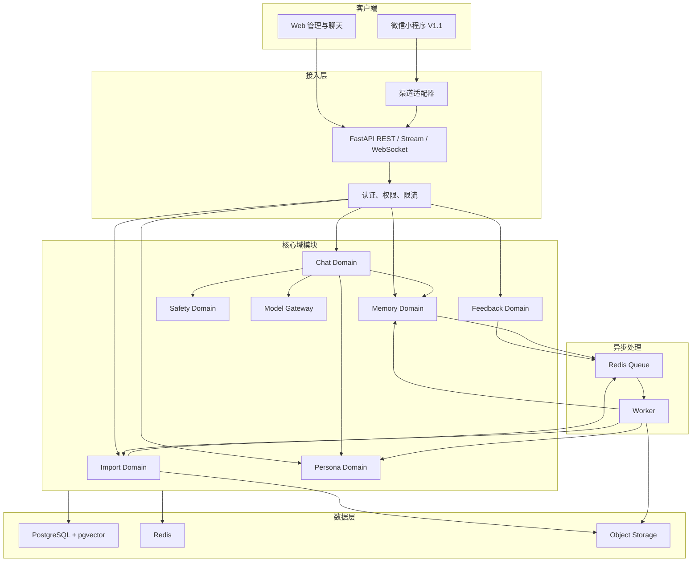
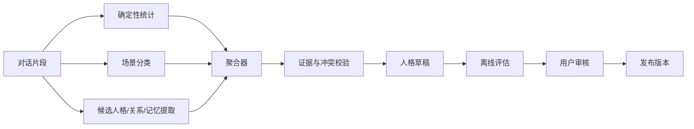

# 对话人格陪伴产品 V1 技术方案

> 文档状态：Draft  
> 架构阶段：V1 模块化单体  
> 更新时间：2026-07-30  
> 关联文档：[V1 PRD](./01-prd-persona-companion-mvp.md) · [实施方案](./02-implementation-plan.md) · [长期记忆机制设计](../agent-long-term-memory-design.md)

## 1. 技术目标

系统需要支持：

- 大体量聊天文件的异步导入和处理。
- 可解释的人格构建。
- 人格、关系、记忆和真实范例的分层管理。
- 低延迟流式聊天。
- 多用户和多人格隔离。
- 可控的增量学习。
- 人格版本发布和回滚。
- Web、微信小程序等多渠道复用。
- 完整数据删除与审计。

V1 优先保证正确性和可观测性，不追求过早分布式化。

## 2. 技术选型

### 2.1 推荐栈

| 层 | 选型 | 用途 |
|---|---|---|
| Web 前端 | Next.js + TypeScript | 管理后台和聊天界面 |
| API 后端 | FastAPI + Python | 类型化 API、AI 管线和流式接口 |
| 数据访问 | SQLAlchemy 2.x + Alembic | ORM、事务和迁移 |
| 主数据库 | PostgreSQL | 用户、消息、人格、记忆、版本和审计 |
| 向量检索 | pgvector | 情景记忆和真实范例语义检索 |
| 关键词检索 | PostgreSQL FTS | 名称、错误码、精确用词检索 |
| 缓存与队列 | Redis | 会话缓存、限流和异步任务 |
| Worker | Celery / Dramatiq 二选一 | 导入、构建、评估和记忆任务 |
| 对象存储 | S3 兼容存储 | 原始上传、解析产物和导出包 |
| 模型层 | 自建 Model Gateway | 多模型供应商适配、预算和重试 |
| 可观测性 | OpenTelemetry + 指标/日志后端 | Trace、延迟、错误和模型费用 |
| 本地环境 | Docker Compose | 一键启动依赖 |

### 2.2 选择理由

#### FastAPI

- 适合 Python AI 生态。
- 类型注解和请求校验清晰。
- 自动生成 OpenAPI。
- 支持 APIRouter、依赖注入和 WebSocket。
- 聊天流式接口与后台管理 API 可以共享认证和权限依赖。

FastAPI 自带 `BackgroundTasks` 适合轻量响应后任务；人格构建、批量提取和索引等重任务仍应交给独立队列 Worker，避免进程重启导致任务丢失。

#### PostgreSQL + pgvector

- V1 可以同时保存结构化画像、消息、版本、权限和向量。
- 支持事务，方便人格发布与回滚。
- 减少早期部署组件。
- 规模和召回需求明确后，再考虑拆分专用向量库或图数据库。

### 2.3 V1 不采用

- 不拆人格、记忆、聊天为独立微服务。
- 不使用 Neo4j 作为基础依赖。
- 不以专用向量数据库替代主数据源。
- 不把全部业务写在 LangChain 等编排框架内部。
- 不在模型权重中保存用户事实。

## 3. 总体架构



## 4. 代码组织

推荐单仓：

```text
persona-companion/
├── apps/
│   ├── api/
│   │   ├── app/
│   │   │   ├── main.py
│   │   │   ├── routers/
│   │   │   ├── auth/
│   │   │   ├── domains/
│   │   │   │   ├── imports/
│   │   │   │   ├── personas/
│   │   │   │   ├── memories/
│   │   │   │   ├── conversations/
│   │   │   │   ├── feedback/
│   │   │   │   └── safety/
│   │   │   ├── model_gateway/
│   │   │   ├── db/
│   │   │   └── observability/
│   │   └── tests/
│   ├── worker/
│   │   ├── tasks/
│   │   └── tests/
│   └── web/
│       ├── app/
│       ├── components/
│       └── tests/
├── packages/
│   ├── schemas/
│   ├── prompts/
│   ├── evaluation/
│   └── channel-adapters/
├── migrations/
├── infra/
│   ├── docker/
│   └── compose.yaml
├── docs/
└── README.md
```

模块之间通过显式 Python 接口交互，禁止 Router 直接访问其他模块的数据表。

## 5. 核心域模型

## 5.1 用户与人格项目

```text
User
  └── PersonaProject
        ├── ImportBatch
        ├── PersonaVersion
        ├── RelationshipProfile
        ├── MemoryItem
        ├── DialogueExample
        └── Conversation
```

### persona_projects

```sql
id UUID PRIMARY KEY
tenant_id UUID NOT NULL
owner_user_id UUID NOT NULL
display_name TEXT NOT NULL
relationship_type TEXT
status TEXT NOT NULL
consent_status TEXT NOT NULL
active_persona_version_id UUID
memory_write_enabled BOOLEAN DEFAULT TRUE
created_at TIMESTAMPTZ NOT NULL
updated_at TIMESTAMPTZ NOT NULL
deleted_at TIMESTAMPTZ
```

所有业务查询必须同时约束 `tenant_id` 和授权主体。

## 5.2 原始消息

### source_messages

```sql
id UUID PRIMARY KEY
tenant_id UUID NOT NULL
persona_project_id UUID NOT NULL
import_batch_id UUID NOT NULL
source_message_key TEXT
message_fingerprint TEXT NOT NULL
conversation_key TEXT
speaker_id UUID NOT NULL
sent_at TIMESTAMPTZ
message_type TEXT NOT NULL
raw_text_encrypted BYTEA
normalized_text TEXT
reply_to_source_key TEXT
metadata JSONB NOT NULL DEFAULT '{}'
processing_status TEXT NOT NULL
created_at TIMESTAMPTZ NOT NULL
UNIQUE (persona_project_id, message_fingerprint)
```

原始文本是否加密和保留多久由隐私策略决定。用于检索的脱敏内容与原始内容分开保存。

## 5.3 对话片段

### dialogue_segments

```sql
id UUID PRIMARY KEY
persona_project_id UUID NOT NULL
start_time TIMESTAMPTZ
end_time TIMESTAMPTZ
scene_type TEXT
participants JSONB
context_text TEXT
target_reply_text TEXT
quality_score REAL
embedding VECTOR
source_message_ids UUID[]
created_at TIMESTAMPTZ NOT NULL
```

对话片段是人格提取和范例检索的基本单位，不直接以单条消息作为全部学习材料。

## 5.4 人格特征

### persona_traits

```sql
id UUID PRIMARY KEY
persona_version_id UUID NOT NULL
trait_key TEXT NOT NULL
trait_category TEXT NOT NULL
description TEXT NOT NULL
value_json JSONB
confidence REAL NOT NULL
status TEXT NOT NULL
locked BOOLEAN DEFAULT FALSE
created_at TIMESTAMPTZ NOT NULL
UNIQUE (persona_version_id, trait_key)
```

### persona_trait_evidence

```sql
trait_id UUID NOT NULL
source_message_id UUID
dialogue_segment_id UUID
evidence_type TEXT NOT NULL
evidence_weight REAL NOT NULL
quoted_span_redacted TEXT
```

## 5.5 记忆

沿用长期记忆文档中的分层：

- `working`：会话短期状态。
- `semantic`：用户、目标人物和实体事实。
- `episodic`：共同经历。
- `procedural`：对话方式和经过确认的关系规则。
- `relationship`：双方专属关系信息。

### memory_items

```sql
id UUID PRIMARY KEY
tenant_id UUID NOT NULL
persona_project_id UUID NOT NULL
namespace TEXT[] NOT NULL
memory_type TEXT NOT NULL
subject TEXT
predicate TEXT
content_json JSONB NOT NULL
content_text TEXT NOT NULL
confidence REAL NOT NULL
importance REAL NOT NULL
sensitivity TEXT NOT NULL
source_kind TEXT NOT NULL
source_ids UUID[]
valid_from TIMESTAMPTZ
valid_to TIMESTAMPTZ
status TEXT NOT NULL
embedding VECTOR
created_at TIMESTAMPTZ NOT NULL
updated_at TIMESTAMPTZ NOT NULL
deleted_at TIMESTAMPTZ
```

## 5.6 对话范例

### dialogue_examples

```sql
id UUID PRIMARY KEY
persona_project_id UUID NOT NULL
persona_version_id UUID
input_context TEXT NOT NULL
target_response TEXT NOT NULL
scene_type TEXT
relationship_context TEXT
source_kind TEXT NOT NULL
quality_score REAL NOT NULL
approved BOOLEAN NOT NULL
embedding VECTOR
source_message_ids UUID[]
created_at TIMESTAMPTZ NOT NULL
```

`source_kind`：

- `historical_real`
- `user_corrected`
- `synthetic_unapproved`

只有 `historical_real` 和经过用户确认的 `user_corrected` 可以进入生产范例检索。

## 5.7 人格版本

### persona_versions

```sql
id UUID PRIMARY KEY
persona_project_id UUID NOT NULL
version TEXT NOT NULL
status TEXT NOT NULL
parent_version_id UUID
build_id UUID
change_summary JSONB
evaluation_report JSONB
created_by UUID
created_at TIMESTAMPTZ NOT NULL
published_at TIMESTAMPTZ
UNIQUE (persona_project_id, version)
```

发布人格版本使用数据库事务：

1. 验证版本状态。
2. 写入发布记录。
3. 更新项目的 `active_persona_version_id`。
4. 失效相关缓存。
5. 写审计日志。

## 5.8 关系画像

### relationship_profiles

```sql
id UUID PRIMARY KEY
tenant_id UUID NOT NULL
persona_project_id UUID NOT NULL
persona_version_id UUID NOT NULL
profile_json JSONB NOT NULL
confidence REAL NOT NULL
source_ids UUID[]
created_at TIMESTAMPTZ NOT NULL
updated_at TIMESTAMPTZ NOT NULL
UNIQUE (persona_version_id)
```

`profile_json` 包含称呼、常聊话题、互动主动性、关心方式、冲突处理、关系边界和双方专属表达。关系画像按人格版本保存，不能直接覆盖历史版本。

## 5.9 会话与消息

### conversations

```sql
id UUID PRIMARY KEY
tenant_id UUID NOT NULL
persona_project_id UUID NOT NULL
user_id UUID NOT NULL
persona_version_id UUID NOT NULL
channel TEXT NOT NULL
channel_conversation_key TEXT
status TEXT NOT NULL
created_at TIMESTAMPTZ NOT NULL
updated_at TIMESTAMPTZ NOT NULL
```

### chat_messages

```sql
id UUID PRIMARY KEY
tenant_id UUID NOT NULL
conversation_id UUID NOT NULL
role TEXT NOT NULL
content_encrypted BYTEA
content_redacted TEXT
idempotency_key TEXT
generation_trace_id TEXT
source_kind TEXT NOT NULL
created_at TIMESTAMPTZ NOT NULL
UNIQUE (conversation_id, idempotency_key)
```

`source_kind` 用于区分：

- `user`
- `ai_generated`
- `channel_imported`
- `human_corrected`

这项标记是阻止 AI 输出污染人格学习的基础约束。

## 5.10 反馈与候选更新

### message_feedback

```sql
id UUID PRIMARY KEY
tenant_id UUID NOT NULL
persona_project_id UUID NOT NULL
message_id UUID NOT NULL
user_id UUID NOT NULL
rating TEXT NOT NULL
reason_codes TEXT[]
comment TEXT
ideal_response TEXT
created_at TIMESTAMPTZ NOT NULL
```

### persona_update_proposals

```sql
id UUID PRIMARY KEY
persona_project_id UUID NOT NULL
base_persona_version_id UUID NOT NULL
status TEXT NOT NULL
proposed_changes JSONB NOT NULL
evidence_feedback_ids UUID[]
evaluation_report JSONB
created_by TEXT NOT NULL
reviewed_by UUID
created_at TIMESTAMPTZ NOT NULL
reviewed_at TIMESTAMPTZ
```

## 5.11 导入、构建与异步任务

### import_batches

保存文件指纹、对象存储引用、解析器版本、参与者统计、清洗报告和状态。

### persona_builds

保存输入数据集哈希、Pipeline 版本、Prompt 版本、模型配置、进度、检查点、费用和构建结果。

### background_jobs

保存任务幂等键、任务类型、状态、尝试次数、错误摘要和死信状态。Redis 负责调度，PostgreSQL 保存可恢复的业务任务事实。

## 6. 导入管线

## 6.1 标准消息 Schema

```json
{
  "schema_version": "1.0",
  "conversation_id": "source-conv-001",
  "message_id": "source-msg-001",
  "speaker_external_id": "participant-a",
  "speaker_name": "小林",
  "timestamp": "2025-10-12T21:30:00+08:00",
  "type": "text",
  "text": "还没睡，在改那个项目",
  "reply_to": "source-msg-000",
  "attachments": [],
  "metadata": {}
}
```

## 6.2 处理步骤

```text
上传
→ 文件类型与大小验证
→ 存入隔离对象存储
→ 创建 ImportBatch
→ 解析为标准消息
→ 计算消息指纹
→ 去重
→ 参与者统计
→ 等待身份确认
→ 文本标准化
→ 敏感信息扫描
→ 对话分段
→ 生成清洗报告
→ 等待用户确认
```

## 6.3 消息指纹

建议由以下字段生成：

```text
hash(
  normalized_speaker
  + normalized_timestamp
  + normalized_message_type
  + normalized_content
)
```

如果源格式有稳定消息 ID，则同时保存但不单独依赖它。

## 6.4 对话分段

结合：

- 时间间隔。
- 参与者轮换。
- 回复引用。
- 主题变化。
- 系统消息。

先用确定性规则产生初始片段，再由轻量模型补充场景标签。禁止让 LLM 改写原始消息。

## 7. 人格构建管线

## 7.1 构建任务



## 7.2 提取原则

- 短期情绪不直接升级为稳定人格。
- 对当前用户的行为优先写入关系画像。
- 无证据的结论只能是低置信度候选。
- 统计型特征优先使用程序计算。
- LLM 负责语义归纳，不负责伪造统计量。
- 每个批次输出严格 JSON Schema。

## 7.3 画像类别

```text
language_style
response_length
message_chunking
formality
directness
humor
emoji_usage
questioning_style
comfort_style
advice_style
conflict_style
initiative
knowledge_boundary
scene_specific_behavior
relationship_specific_behavior
```

## 7.4 构建幂等性

任务唯一键：

```text
persona_project_id
+ input_dataset_hash
+ pipeline_version
+ prompt_version
+ model_config_hash
```

相同输入与配置不重复收费构建，除非用户显式要求重建。

## 8. 聊天运行时

## 8.1 请求流程

```text
认证和权限
→ 写入用户消息
→ 加载固定 PersonaVersion
→ 场景和风险识别
→ 生成 MemoryQueryPlan
→ 查询结构化人格与关系
→ 检索情景记忆
→ 检索真实对话范例
→ 重排和去重
→ 按 Token 预算组装上下文
→ 调用模型
→ 人格一致性与安全检查
→ 流式返回
→ 保存最终回复
→ 发送异步记忆候选任务
```

## 8.2 上下文分区

```text
[IMMUTABLE SAFETY]
不可变身份、安全和行为限制

[PERSONA CORE]
本次相关的稳定人格特征

[RELATIONSHIP]
称呼、互动方式、边界和共同关系背景

[CURRENT STATE]
当前会话主题和短期状态

[RELEVANT MEMORIES]
少量相关共同经历

[REAL DIALOGUE EXAMPLES]
与当前场景相似的真实回复范例

[RECENT MESSAGES]
最近原始对话

[CURRENT USER MESSAGE]
当前输入
```

## 8.3 Token 预算

每个分区独立限制：

- 安全与身份不可被截断。
- 当前消息和最近对话优先级高于远期记忆。
- 真实范例限制数量与总字符。
- 相同事实不得在画像和记忆中重复注入。
- 长对话采用滚动摘要，但用户明确边界单独保存。

## 8.4 记忆检索

综合：

- PostgreSQL 结构化过滤。
- 全文关键词匹配。
- pgvector 语义相似度。
- 时间新鲜度。
- 重要性。
- 置信度。
- 关系和场景匹配。
- 冲突与过期惩罚。

召回后再次执行权限、有效期和敏感等级过滤。

## 8.5 范例检索

范例排序重点：

- 当前场景一致。
- 关系上下文一致。
- 用户情绪和意图相近。
- 目标人物回复质量高。
- 避免连续召回相同口头禅。
- 优先真实历史范例。

范例用于引导风格，禁止逐字复制包含隐私或第三方身份的信息。

## 8.6 流式协议

V1 可采用：

- Web：SSE 或 WebSocket。
- V1.1 小程序：根据客户端和网关支持选择 WebSocket 或分段轮询。

事件示例：

```json
{"type":"message.started","message_id":"msg_1"}
{"type":"message.delta","delta":"先别"}
{"type":"message.delta","delta":"全重新看了"}
{"type":"message.completed","message_id":"msg_1"}
```

聊天接口必须支持 `idempotency_key`，避免网络重试生成两次回复。

## 9. 持续补全机制

## 9.1 数据来源等级

从高到低：

1. 新增目标人物真实聊天。
2. 用户明确修正后的理想回复。
3. 用户对人格特征的显式修改。
4. 多次一致的像 / 不像反馈。
5. 单次反馈。
6. AI 自己生成的回复。

第 6 类默认权重为 0，不作为学习证据。

## 9.2 反馈聚合

单条反馈只写入事实表，不直接修改人格。

定期任务：

```text
聚合同类反馈
→ 找到受影响的人格特征
→ 生成差异候选
→ 关联证据
→ 运行离线评估
→ 进入 pending_review
```

## 9.3 防漂移

- 核心身份和安全规则不可学习。
- 锁定人格特征不可自动修改。
- 每次更新限制最大变化幅度。
- 新版本必须与历史测试集比较。
- 风格变得更极端时触发警报。
- 可一键回滚。

## 10. API 设计

## 10.1 导入

```http
POST /v1/persona-projects
POST /v1/persona-projects/{project_id}/imports
GET  /v1/imports/{import_id}
GET  /v1/imports/{import_id}/participants
POST /v1/imports/{import_id}/identity-confirmation
GET  /v1/imports/{import_id}/cleaning-report
POST /v1/imports/{import_id}/approve
```

## 10.2 人格

```http
POST  /v1/persona-projects/{project_id}/builds
GET   /v1/builds/{build_id}
GET   /v1/persona-projects/{project_id}/traits
PATCH /v1/persona-projects/{project_id}/traits/{trait_id}
GET   /v1/persona-projects/{project_id}/versions
POST  /v1/persona-projects/{project_id}/versions/{version_id}/publish
POST  /v1/persona-projects/{project_id}/versions/{version_id}/rollback
```

## 10.3 记忆与范例

```http
GET    /v1/persona-projects/{project_id}/memories
PATCH  /v1/persona-projects/{project_id}/memories/{memory_id}
DELETE /v1/persona-projects/{project_id}/memories/{memory_id}
GET    /v1/persona-projects/{project_id}/dialogue-examples
PATCH  /v1/persona-projects/{project_id}/dialogue-examples/{example_id}
```

## 10.4 聊天

```http
POST /v1/conversations
GET  /v1/conversations/{conversation_id}
POST /v1/conversations/{conversation_id}/messages
GET  /v1/conversations/{conversation_id}/stream
```

发送消息：

```json
{
  "content": "明天要面试了，有点慌",
  "persona_version": "active",
  "idempotency_key": "client-generated-uuid"
}
```

## 10.5 反馈

```http
POST /v1/messages/{message_id}/feedback
GET  /v1/persona-projects/{project_id}/feedback
POST /v1/persona-projects/{project_id}/update-proposals
GET  /v1/update-proposals/{proposal_id}
POST /v1/update-proposals/{proposal_id}/approve
POST /v1/update-proposals/{proposal_id}/reject
```

## 11. 模型网关

业务模块不得直接调用某家模型 SDK。

接口：

```python
class ModelGateway:
    async def generate(self, request: GenerateRequest) -> GenerateResult:
        ...

    async def stream(self, request: GenerateRequest):
        ...

    async def embed(self, texts: list[str]) -> list[list[float]]:
        ...

    async def classify(self, request: ClassifyRequest) -> ClassifyResult:
        ...
```

网关负责：

- 模型路由。
- 超时和有限重试。
- 预算。
- 速率限制。
- Prompt 版本。
- 结构化输出校验。
- 敏感日志脱敏。
- 供应商故障降级。

## 12. 异步任务

任务类型：

```text
import.parse
import.clean
persona.extract
persona.aggregate
persona.evaluate
memory.extract
memory.consolidate
feedback.aggregate
persona.update_propose
data.delete
index.rebuild
```

要求：

- 每个任务有幂等键。
- 至少一次投递下不能产生重复数据。
- 有最大重试次数和死信状态。
- 大任务可记录检查点。
- 任务参数只存对象引用，不在 Redis 中传整个聊天文件。

## 13. 权限与数据隔离

### 13.1 权限模型

角色：

- Owner：完整管理。
- Editor：可修改人格和记忆。
- Viewer：仅可聊天和查看有限内容。
- Service Principal：渠道适配器。

### 13.2 数据隔离

- 所有表包含 `tenant_id`。
- Repository 层强制要求 `Principal`。
- 对象存储路径使用不可预测 ID。
- 下载使用短时签名链接。
- 向量检索必须先过滤租户和人格项目。
- 缓存键包含租户与人格项目。

## 14. 隐私与安全

### 14.1 上传安全

- 文件类型白名单。
- 大小和数量限制。
- 压缩文件解压配额。
- 恶意文件扫描。
- 原始文件隔离。
- 解析器在受限 Worker 中运行。

### 14.2 敏感数据

- 密钥和凭证禁止写入长期记忆。
- 高敏感字段加密。
- 日志不记录原始聊天正文。
- 管理员查看敏感证据需要审计。

### 14.3 提示注入

历史聊天、记忆和范例全部视为不可信数据：

- 以数据区块注入，不赋予指令优先级。
- 删除或标记“忽略规则”等提示注入文本。
- 工具调用权限由代码控制。
- 聊天人格 V1 不具备任意外部执行工具。

### 14.4 删除

删除任务覆盖：

1. 原始上传。
2. 解析消息。
3. 人格证据。
4. 画像。
5. 记忆。
6. 范例。
7. 向量索引。
8. 缓存。
9. 派生摘要。
10. 模型供应商侧可控的数据保留请求。

审计日志保留最小操作事实，不保留已删除聊天正文。

## 15. 可观测性

每次聊天 Trace：

```text
request
→ auth
→ scene_classification
→ profile_lookup
→ memory_retrieval
→ example_retrieval
→ context_build
→ model_call
→ persona_check
→ safety_check
→ persist
```

记录：

- `trace_id`
- `tenant_id` 的不可逆标识
- 人格版本
- 检索条数
- Token 数
- 模型和 Prompt 版本
- 首 Token 延迟
- 总延迟
- 费用
- 安全判定
- 用户反馈

不得在普通日志中记录完整聊天正文。

## 16. 评估

## 16.1 离线留出集

按时间或对话片段留出一部分真实聊天：

- 人格构建时不可访问。
- 输入留出片段中的上文。
- 让系统生成目标人物回复。
- 与真实回复和基线方案比较。

## 16.2 指标

- 人格盲测偏好率。
- 回复长度差异。
- 场景行为一致率。
- 关系表达一致率。
- 事实错误率。
- 不应知道信息的使用率。
- 真实范例 Recall@K。
- 风格夸张率。
- 跨版本回归失败数。

文本相似度仅作辅助，因为合理回复可能与真实回复不同。

## 16.3 在线指标

- 像 / 不像比例。
- “不像”原因。
- 修改理想回复比例。
- 同一人格随版本的改善。
- 用户撤销或回滚次数。

## 17. 部署架构

### 17.1 V1

```text
CDN / Reverse Proxy
  ├── Web App
  └── FastAPI
        ├── PostgreSQL + pgvector
        ├── Redis
        ├── Worker
        └── Object Storage
```

API 可以水平扩容，但 WebSocket 需要共享状态或采用负载均衡粘性策略。若选择 SSE，重连与幂等处理更简单。

### 17.2 备份

- PostgreSQL 定期备份和时间点恢复。
- 对象存储开启版本或生命周期策略。
- Redis 不作为人格和记忆的唯一数据源。
- 定期执行恢复演练。

## 18. 微信小程序适配

V1.1 增加 `channel-adapters/wechat-miniapp`，核心人格服务不感知微信协议。

### 18.1 身份映射

```text
WeChat OpenID / UnionID
→ ChannelIdentity
→ Internal User
→ Authorized PersonaProject
```

### 18.2 消息适配

```python
class ChannelAdapter:
    async def authenticate(self, request) -> ChannelPrincipal:
        ...

    async def to_chat_request(self, payload) -> ChatRequest:
        ...

    async def send_response(self, response: ChatResponse) -> None:
        ...
```

### 18.3 原则

- 小程序只保存必要的本地 UI 状态。
- 人格、记忆和会话以核心后端为准。
- 微信渠道请求使用幂等键。
- 不通过普通个人微信号 Hook 接入。
- 平台审核、域名、备案、隐私政策和内容安全在 V1.1 单独验收。

## 19. 性能与成本控制

### 19.1 导入

- 分批处理，不把全部聊天塞入一次模型请求。
- 确定性统计不调用 LLM。
- 相同片段和 Prompt 版本使用缓存。
- 低价值片段不生成 Embedding。

### 19.2 聊天

- 画像结构化读取。
- 先元数据过滤再向量搜索。
- 限制记忆和范例数量。
- 小模型承担分类和重排，大模型负责最终回复。
- 每个人格设置日预算和单轮 Token 上限。

### 19.3 降级

模型或检索故障时：

- 不编造已召回的历史事实。
- 可以使用当前会话和核心人格继续回复。
- 明确记录降级状态。
- 不在失败后重复写入记忆。

## 20. 技术验收清单

- [ ] 本地一键启动
- [ ] OpenAPI 可访问
- [ ] 数据库迁移可升级和回滚
- [ ] 导入任务幂等
- [ ] 人格构建可恢复
- [ ] 人格特征证据可追踪
- [ ] 记忆检索强制租户过滤
- [ ] 聊天流式接口可重连
- [ ] 消息请求具备幂等键
- [ ] AI 输出不会进入真实范例
- [ ] 人格版本可发布和回滚
- [ ] 删除覆盖向量、缓存和派生数据
- [ ] 日志不包含完整聊天正文
- [ ] 评估优于长 Prompt 基线
- [ ] 微信渠道与核心业务解耦

## 21. 参考资料

- [FastAPI：Bigger Applications](https://fastapi.tiangolo.com/tutorial/bigger-applications/)
- [FastAPI：WebSockets](https://fastapi.tiangolo.com/advanced/websockets/)
- [FastAPI：Background Tasks](https://fastapi.tiangolo.com/tutorial/background-tasks/)
- [pgvector：Open-source vector similarity search for PostgreSQL](https://github.com/pgvector/pgvector)
- [PostgreSQL：Full Text Search](https://www.postgresql.org/docs/current/textsearch.html)
- [Redis：Streams](https://redis.io/docs/latest/develop/data-types/streams/)
- [微信公众平台：接收普通消息](https://developers.weixin.qq.com/doc/offiaccount/Message_Management/Receiving_standard_messages.html)
- [微信小程序：客服消息](https://developers.weixin.qq.com/miniprogram/dev/OpenApiDoc/kf-mgnt/kf-message/sendCustomMessage.html)
